<div align="center">


</div>
# VitalsAI
### Intelligent Disease Prediction System

</div>

---

# 🏥 VitalsAI — AI-Powered Health Prediction Platform

<div align="center">


**AI-powered platform for predicting Heart Disease, Brain Stroke, Diabetes, Kidney Disease & Eye Disease — with an intelligent health chatbot powered by Claude AI.**

*Final Year Project · Ahmedabad Institute of Technology · GTU · 2026*

</div>

---

## 📸 Screenshots

### 🔐 Login Page
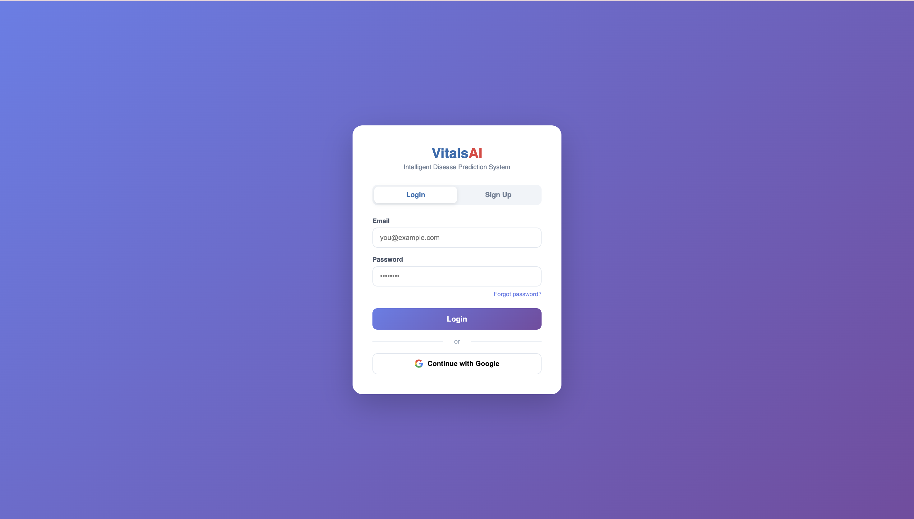

### 🏠 Dashboard
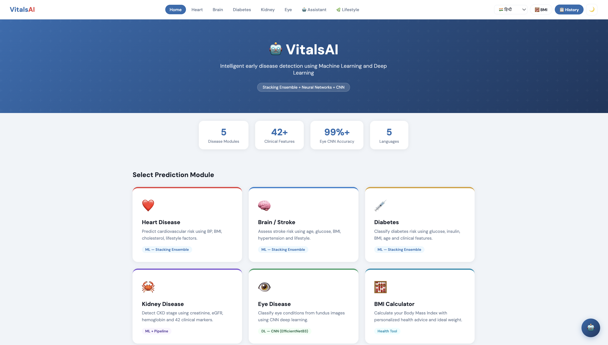
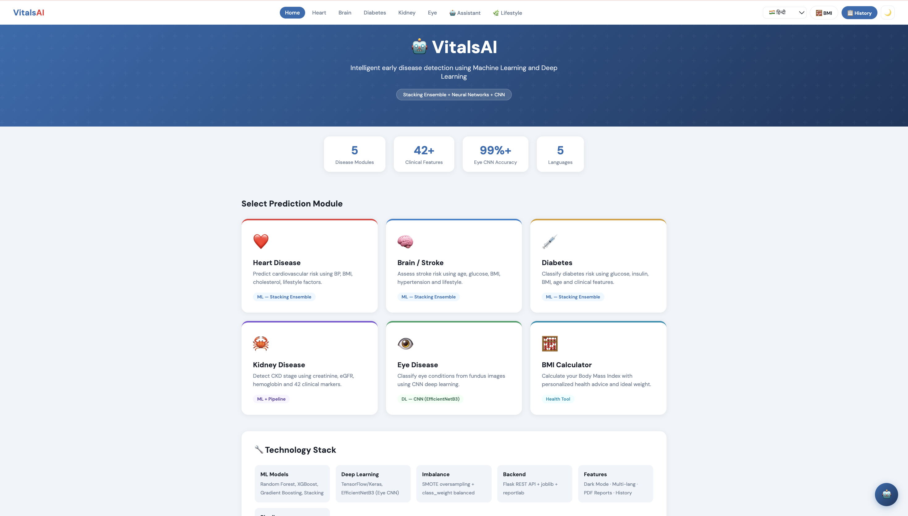
---

### ❤️ Heart Disease Prediction
<table>
<tr>
<td>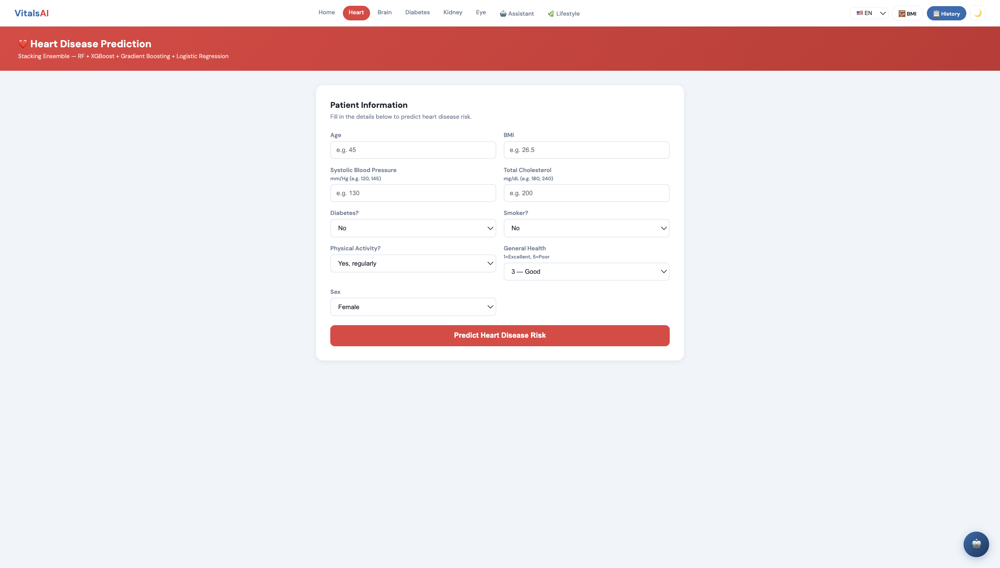</td>
<td>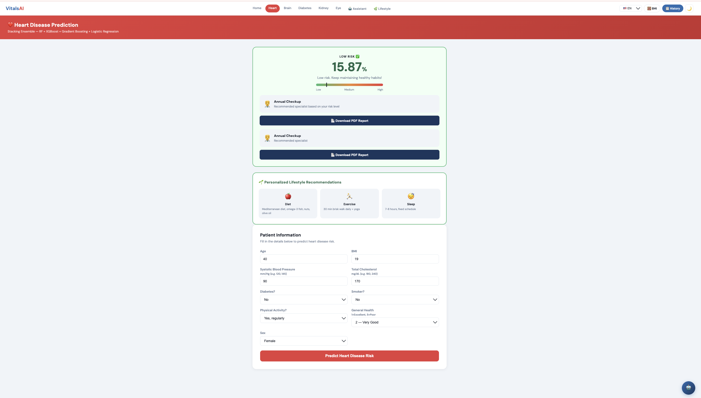</td>
</tr>
<tr>
<td align="center">Input Form</td>
<td align="center">Result + Lifestyle Tips + PDF</td>
</tr>
</table>

---

### 🧠 Brain Stroke Prediction
<table>
<tr>
<td>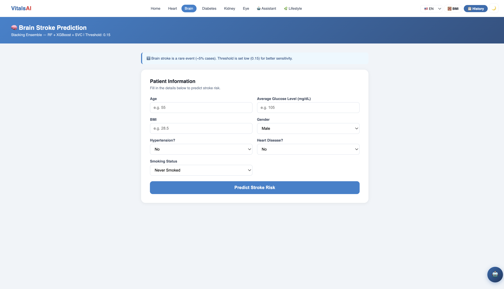</td>
<td>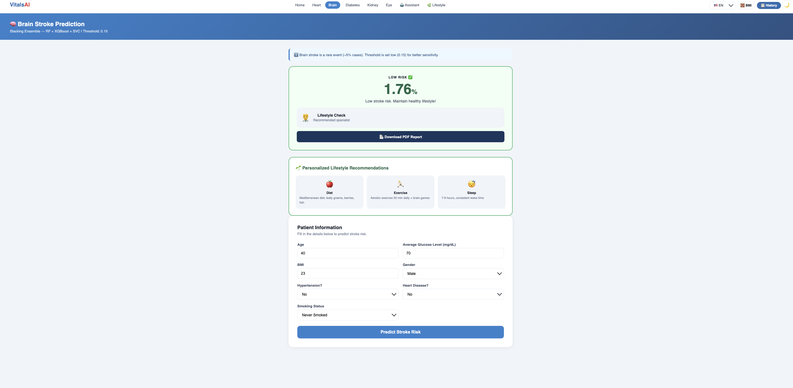</td>
</tr>
<tr>
<td align="center">Input Form</td>
<td align="center">Risk Assessment</td>
</tr>
</table>

---

### 🩸 Diabetes Prediction
<table>
<tr>
<td>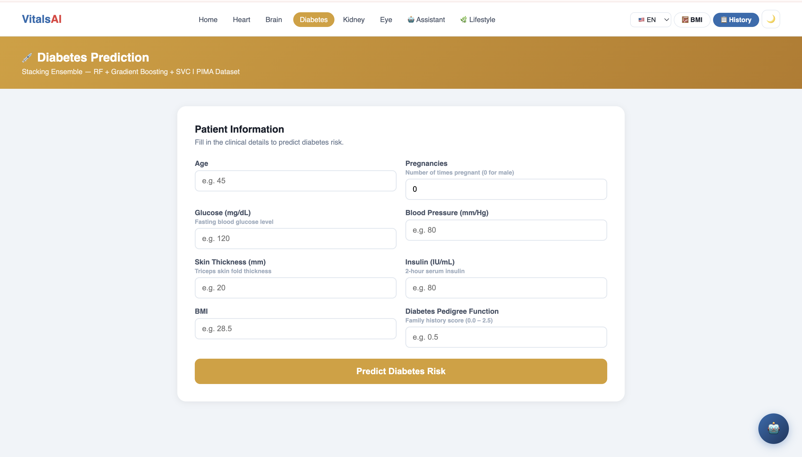</td>
<td>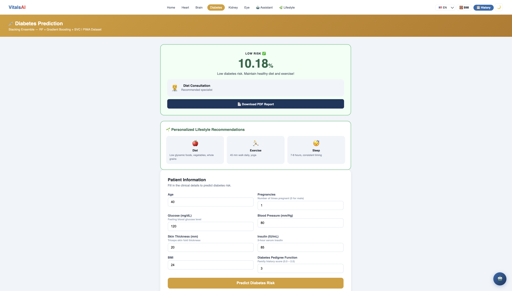</td>
</tr>
<tr>
<td align="center">Clinical Input</td>
<td align="center">Result + Recommendations</td>
</tr>
</table>

---

### 🫘 Kidney Disease Prediction
<table>
<tr>
<td>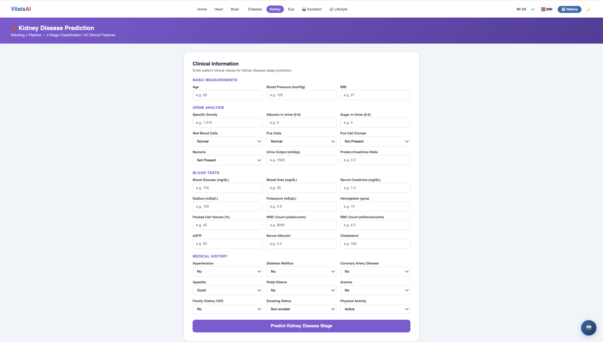</td>
<td>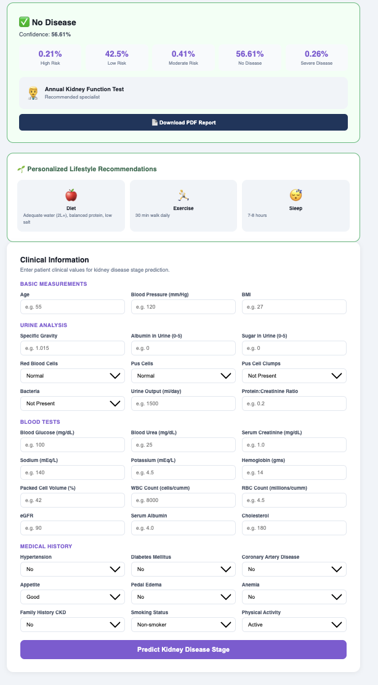</td>
</tr>
<tr>
<td align="center">42 Clinical Features</td>
<td align="center">5-Stage Classification</td>
</tr>
</table>

---

### 👁️ Eye Disease Classification (CNN)
<table>
<tr>
<td>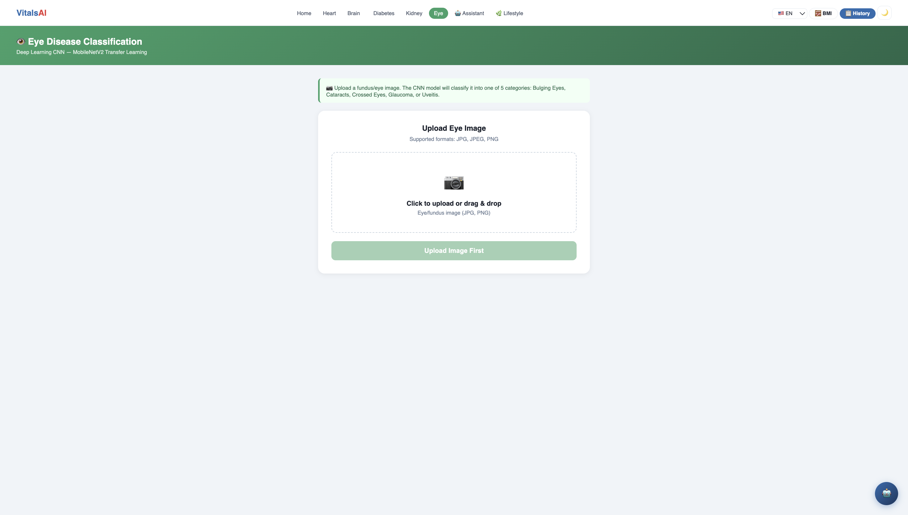</td>
<td>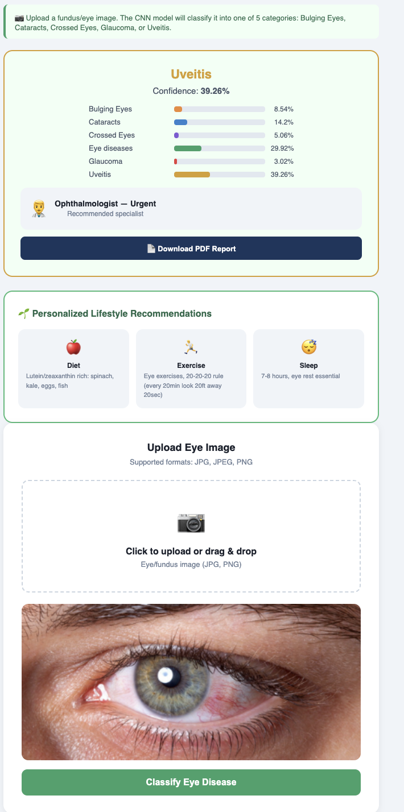</td>
</tr>
<tr>
<td align="center">Image Upload</td>
<td align="center">CNN Classification Result</td>
</tr>
</table>

---

### 🤖 AI Health Chatbot (Claude AI)


---

### 🌿 Lifestyle Recommender & ⚖️ BMI Calculator
<table>
<tr>
<td>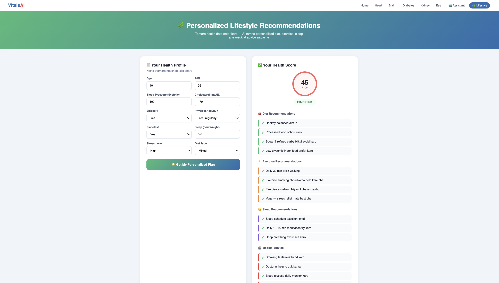</td>
<td>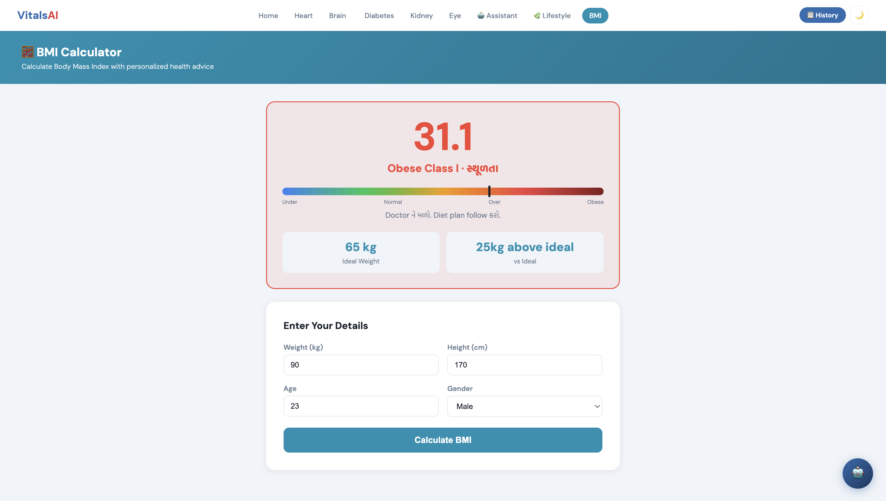</td>
</tr>
<tr>
<td align="center">Personalized Health Plan + Score</td>
<td align="center">BMI with Color Meter</td>
</tr>
</table>

---

### 📋 Prediction History
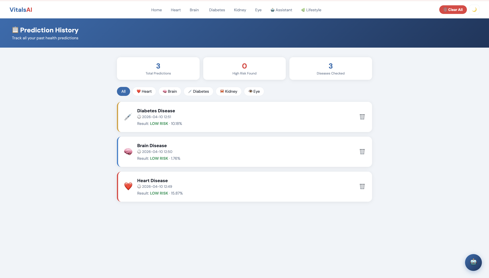

---

### 🩸 Assistant
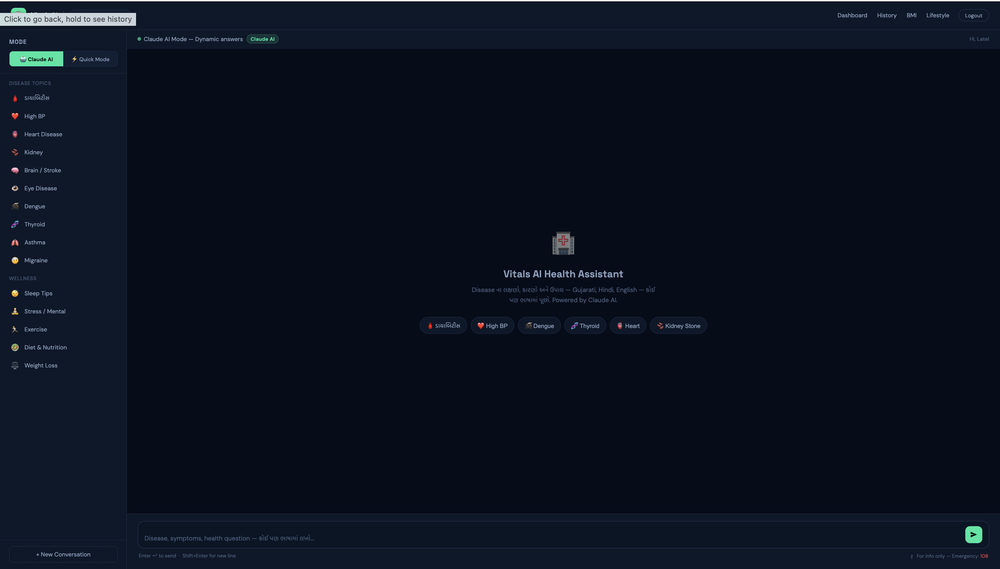

---

## 🩺 Overview

VitalsAI is an end-to-end AI health prediction platform that uses trained ML and deep learning models to assess disease risk from clinical inputs and medical images. It provides instant risk assessment, doctor recommendations, history tracking, PDF reports, and an AI chatbot — all in one web interface.

| Traditional Health Checkup | VitalsAI |
|---|---|
| Requires doctor visit for screening | Instant AI risk assessment from home |
| Single disease per visit | 5 disease modules in one platform |
| No historical tracking | Full prediction history with trends |
| Generic advice | Personalized doctor recommendations |
| No AI assistance | Claude AI health chatbot 24/7 |

---

## ✨ Key Features

### 🔬 Disease Prediction Modules

| Module | Model | Features | Output |
|---|---|---|---|
| 🫀 Heart Disease | Stacking Ensemble (RF + XGBoost + LR) | Age, BMI, BP, Cholesterol, etc. | Risk % + Doctor |
| 🧠 Brain Stroke | Stacking Ensemble (RF + XGBoost + SVC) | Age, Glucose, BMI, Smoking | Risk % + Doctor |
| 🩸 Diabetes | Stacking + StandardScaler | Glucose, Insulin, BMI, etc. | Risk % + Doctor |
| 🫘 Kidney Disease | Pipeline — 5 Stage Classifier | 42 Clinical features | Stage + Confidence |
| 👁️ Eye Disease | CNN — MobileNetV2 Transfer Learning | Retinal fundus image | Disease + Doctor |

### 🤖 AI Health Chatbot
- Powered by **Claude AI (Anthropic)**
- Supports **Gujarati, Hindi, English** — auto-detects language
- Structured response: Symptoms → Causes → Treatment → When to see doctor
- **Claude AI Mode** (dynamic) + **Quick Mode** (offline fallback)

### 📊 Additional Features
- **Google OAuth** + Email/Password login
- **Prediction History** — log with timestamps, disease filter
- **PDF Report** — downloadable per prediction
- **BMI Calculator** — color-coded health meter + ideal weight
- **Lifestyle Recommender** — diet, exercise, sleep, medical advice
- **Health Score** (0–100) based on vitals
- **Multi-language UI** — English, Gujarati, Hindi
- **Dark Mode** toggle
- **Personalized Lifestyle Tips** after every prediction

---

## 🏗️ System Architecture

```
User (Browser)
      │
      ▼
Flask Web Server (app.py)
      │
      ├── /heart      → Stacking Ensemble (.pkl)
      ├── /brain      → Stacking Ensemble (.pkl)
      ├── /diabetes   → Stacking + Scaler (.pkl)
      ├── /kidney     → Pipeline Classifier (.pkl)
      ├── /eye        → CNN MobileNetV2 (.h5)
      │
      ├── /api/chat       → Claude AI API (Anthropic)
      ├── /api/bmi        → BMI Calculator
      ├── /api/recommend  → Lifestyle Engine
      ├── /api/report     → PDF Generator (ReportLab)
      ├── /api/history    → Session Store
      │
      └── Google OAuth 2.0 + Email/Password Auth
```

---

## 🛠️ Tech Stack

| Layer | Technology | Role |
|---|---|---|
| **Language** | Python 3.10+ | Core runtime |
| **Web Framework** | Flask 3.0 | Backend & routing |
| **ML Models** | Scikit-learn (RF, XGBoost, SVC, Stacking) | Heart, Brain, Diabetes, Kidney |
| **Deep Learning** | TensorFlow / Keras (MobileNetV2) | Eye CNN |
| **AI Chatbot** | Anthropic Claude API | Health Q&A |
| **Auth** | Google OAuth 2.0 + Authlib | User login |
| **PDF** | ReportLab | Health reports |
| **Data** | Pandas, NumPy | Processing |
| **Frontend** | HTML5, CSS3, Vanilla JS | Responsive UI |
| **Env** | python-dotenv | Config management |

---

## 📁 Project Structure

```
VitalsAI/
├── app.py                      # Main Flask app
├── models/
│   ├── final_stacking_model.pkl
│   ├── brain_ml_model.pkl
│   ├── diabetes_stack_model.pkl
│   ├── kidney_pipeline.pkl
│   ├── eye_cnn_model.h5
│   └── eye_class_indices.json
├── templates/
│   ├── index.html              # Dashboard
│   ├── login.html              # Auth page
│   ├── heart.html
│   ├── brain.html
│   ├── diabetes.html
│   ├── kidney.html
│   ├── eye.html
│   ├── assistant.html          # Claude AI Chatbot
│   ├── history.html
│   ├── bmi.html
│   └── lifestyle.html
├── docs/images/                # README screenshots
├── .env                        # Secret keys (not committed)
├── .env.example
├── requirements.txt
└── README.md
```

---

## ⚡ Quick Start

### Step 1 — Clone
```bash
git clone https://github.com/Poojanpatel12/VitalsAI.git
cd VitalsAI
```

### Step 2 — Virtual Environment
```bash
python -m venv .venv
source .venv/bin/activate   # macOS/Linux
.venv\Scripts\activate      # Windows
```

### Step 3 — Install Dependencies
```bash
pip install -r requirements.txt
```

### Step 4 — Setup `.env`
```env
ANTHROPIC_API_KEY=your-key-here
GOOGLE_CLIENT_ID=your-client-id
GOOGLE_CLIENT_SECRET=your-client-secret
```

### Step 5 — Run
```bash
python app.py
```
Open **http://localhost:5000**

---

## 🏥 Doctor Recommendation System

| Risk Level | Heart | Brain | Diabetes | Kidney |
|---|---|---|---|---|
| HIGH RISK | Cardiologist | Neurologist | Endocrinologist | Nephrologist — Urgent |
| MEDIUM RISK | General Physician | General Physician | General Physician | GP + Referral |
| LOW RISK | Annual Checkup | Lifestyle Check | Diet Consultation | Annual KFT |

---

## 🔮 Future Improvements

- ☁️ Cloud deployment (AWS / Render)
- 📱 Mobile app (Flutter)
- 🧬 More disease modules (Liver, Thyroid)
- ⌚ Wearable device integration
- 🗄️ Database persistence (PostgreSQL)
- 👨‍⚕️ Doctor portal

---

## 👩‍💻 Author

| Field | Detail |
|---|---|
| **Name** | Poojan Patel |
| **College** | Ahmedabad Institute of Technology |
| **Department** | Computer Engineering (CE) |
| **University** | Gujarat Technological University (GTU) |
| **Year** | Final Year — 2026 |
| **GitHub** | [@Poojanpatel12](https://github.com/Poojanpatel12) |

---

<div align="center">

⭐ **If this project was useful, please consider starring the repository!**

*Built with ❤️ by Poojan Patel · Final Year Project · Ahmedabad Institute of Technology · GTU 2026*

</div>
